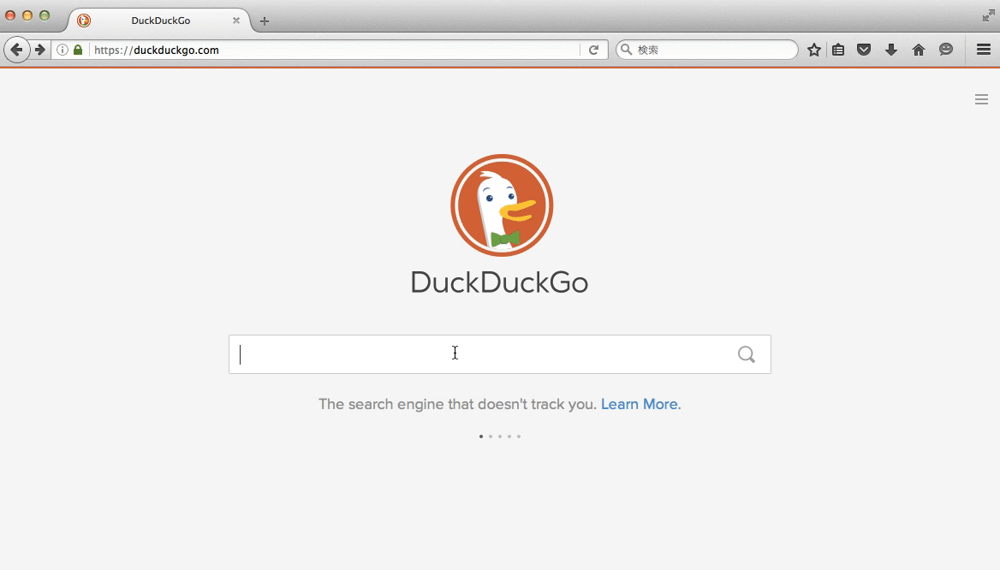

# Starlight Loading

> Anytime, Anywhere with Cinderella.



* **Starlight Loading** is a set of Firefox / Chrome Addon and Javascript Component.
* If you are a Firefox / Chrome user:
    * You can see a starry loading screen whenever you open a website.
* If you are a web master:
    * You can introduce a starry loading screen into your website.

## For Firefox / Chrome User

### Install

* Install add-on from http://starlight.tsudanuma-studio.net/

### Caveat

* I **DO NOT** assure that Starlight Loading works on every site without problems.
    * I cannot be responsible for any trouble caused by using this add-on.

## For Web M@ster

### Install

* Download these 2 files:
    * [starlight-loading.min.js](starlight-loading.min.js)
    * [starlight-loading.min.css](starlight-loading.min.css)

* Add 2 lines into your page:

```html
<head>
  <link href="starlight-loading.min.css" rel="stylesheet" />
  <script src="starlight-loading.min.js"></script>
  ...
```

The above sample is equivarent to the following:

```html
<head>
  <link href="data/mplus-1p-bold-sub-woff.css" rel="stylesheet" />
  <link href="data/pace.css" rel="stylesheet" />
  <link href="data/starlight-loading.css" rel="stylesheet" />
  <script src="data/pace-option.js"></script>
  <script src="data/pace.min.js"></script>
  <script src="data/starlight-loading.js"></script>
  ...
```

* See also: [Build JS & CSS](#build-js--css)

### Supported Browsers

* Recent browsers
* Smartphones are NOT supported

## For Contributor

### Install

* `$ git clone https://github.com/megane42/starlight-loading.git`
* `$ cd starlight-loading`
* `$ brew install node`

### Build JS & CSS

* `$ npm install`
* `$ npm run build`
    * Sometime it doesn't work well...

### Build & Run as a Firefox Addon

* `$ npm install jpm --global`
* `$ jpm run`

### Build & Run as a Chrome Addon

* Open `chrome://settings/` in Chrome
* Click Developer mode > Load unpacked extensions...
* Select starlight-loading directory

### How does it works?

FIXME

## Credits

* Progress bar: [Pace.js](http://github.hubspot.com/pace/docs/welcome/)
* Web font: [M+ Fonts](https://mplus-fonts.osdn.jp/)
* Heart icon & some css advice : [@mikeda3](https://github.com/mikeda3)
* Conversely, Starlight Loading is not endorsed by nor affiliated with BANDAI NAMCO.

## Author

* megane42
    * https://twitter.com/tsdnm
    * https://deresute.me/582302781
